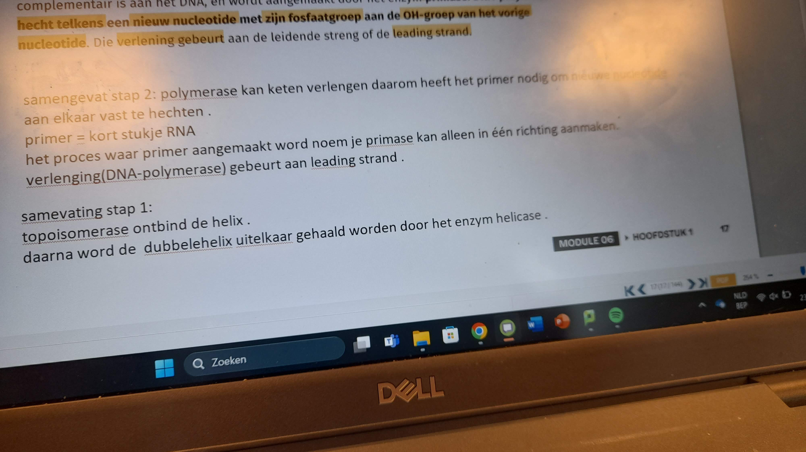
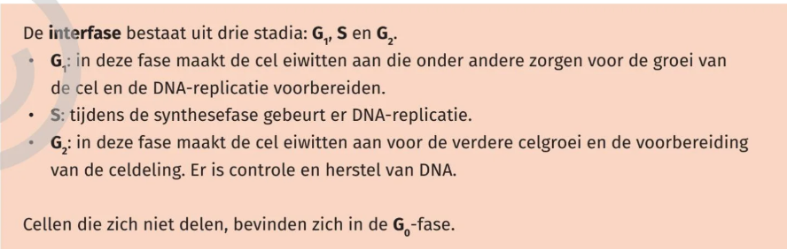

primer:  kort stukje DNA

- Voortplantingcellen zijn Haploïd
- lichaamscellen zijn diploïd

interfase is veel langer dan de celdelingfase
de interfase of groeifase
opdelen in 3 delen:
- **S**(*ynthese*): je DNA gaat verdubbelen voor dat hij kan afsplitsen
- **G**(*ap*): je cel gaat groeien en gaat splitsen 

mitose bij celdeling bij mensen

1. ***DNA*** zit als lange chromatinedraden in de celkern wanneer de cel niet deelt 
2. De *cel* breekt het kernmembraan 
3. De **chromosomen** liggen in het evenaarsvlak. Elk chomosoom heeft 2 zusterchromatiden
4. De **cohensine eiwitten** breken af, waardoor alle steundraden loskomen
5. De **spoelfiguur** wordt ==afgebroken==

